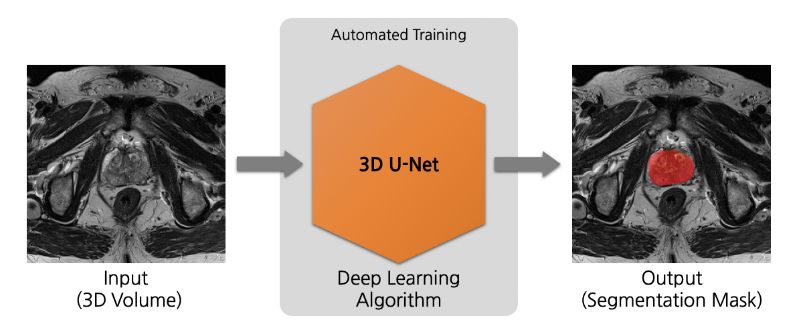
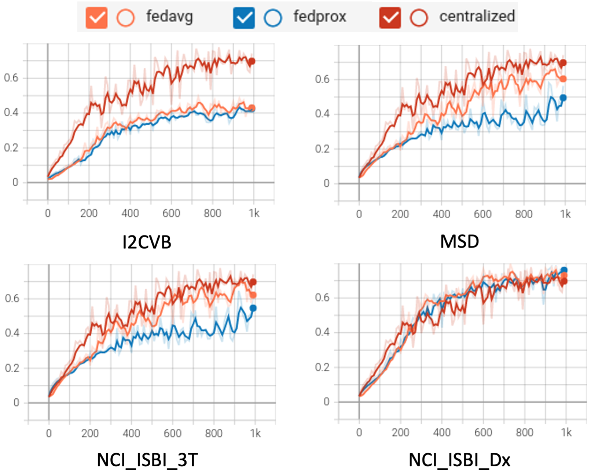

# Federated Learning for Prostate Segmentation from Multi-source Data

## Introduction to MONAI, Prostate and Multi-source Data

### MONAI
This example shows how to use NVFlare on medical image applications.
It uses a python package [MONAI](https://github.com/Project-MONAI/MONAI),
which is a PyTorch-based, open-source framework for deep learning in healthcare imaging, part of PyTorch Ecosystem.

### Prostate
The application shown in this example is volumetric (3D) segmentation of prostate organ region from T2-weighted MRIs based on three datasets that can be split into four clients with comparable sizes.

The [3D U-Net](https://arxiv.org/pdf/1606.06650.pdf) model is trained to segment the region of prostate organ (binary) based on one input MRI scan T2-weighted. 



### Multi-source Data Preparation
To run this example, we are going to make use of three open prostate datasets which we split into four FL clients with comparable sizes. Each of them needs some special preprocessing steps. 

Please go to **/data_preparation** folder to perform download, preprocessing, and datalist generation. From now on for this section, we assume the PWD to be /data_preparation.  
We will download the three datasets to /Raw/$dataset_id/, store the dataset ones to /dataset/$client_id, and use dicom2nifti and pynrrd tools for data format conversion

    pip install dicom2nifti 
    pip install pynrrd
    mkdir Raw
    mkdir dataset
    for dataset in I2CVB MSD NCI_ISBI; do
      mkdir Raw/${dataset}
    done
Below are the steps for each dataset: 

[**I2CVB**](https://i2cvb.github.io/): [data link](https://zenodo.org/record/162231#.YZvNc_HMJuG), download all files to ./Raw/I2CVB  
I2CVB contains files ending with .aa, .ab, etc. These are parts of a .tar.gz file (split for sharing). To extract, run the following

    cat ./Raw/I2CVB/ge-1-5t* > ./Raw/I2CVB/ge-1-5t.tar.gz
    tar xzvf ./Raw/I2CVB/ge-1-5t.tar.gz -C ./Raw/I2CVB/
    cat ./Raw/I2CVB/siemens-3t* > ./Raw/I2CVB/siemens-3t.tar.gz
    tar xzvf ./Raw/I2CVB/siemens-3t.tar.gz -C ./Raw/I2CVB/
This will produce two folders, ./Raw/I2CVB/GE with 21 cases, and ./Raw/I2CVB/Siemens with 19 cases. Multi-sequence images and multi-region masks are stored individually in Dicom format, we use dicom2nifti tool to perform data format conversion to Nifti on T2 images and ground truth for prostate region.
Due to the small data size, we combined the two into one client. Note that there is one case (Patient_428260) with a missing slice from ground truth segmentation, thus we discarded this case.

    bash data_conversion_I2CVB.sh  

[**MSD**](http://medicaldecathlon.com/): [data link](https://drive.google.com/drive/folders/1HqEgzS8BV2c7xYNrZdEAnrHk7osJJ--2), download "Task05_Prostate.tar" to ./Raw/I2CVB, and extract with

    tar xf ./Raw/MSD/Task05_Prostate.tar -C ./Raw/MSD
This will produce folder ./Raw/MSD/Task05_Prostate containing 32 training images with labels, and 16 testing images without labels. Images in this dataset have two channels, and we select the first one, which is T2. Masks in this dataset have two values, we combine the two to get the mask of prostate.

    bash data_conversion_MSD.sh

[**NCI_ISBI**](https://wiki.cancerimagingarchive.net/display/Public/NCI-ISBI+2013+Challenge+-+Automated+Segmentation+of+Prostate+Structures): [data link](https://wiki.cancerimagingarchive.net/pages/viewpage.action?pageId=21267207), download the first 3 .tcia files and download the actual image data with [NBIA Data Retriever](https://wiki.cancerimagingarchive.net/display/NBIA/Downloading+TCIA+Images), store them to ./Raw/NCI_ISBI/Image/Training(Test, Leaderboard). Then download the second 3 .zip files for ground truth segmentations and store them to ./Raw/NCI_ISBI/Mask, extract with  
    
    unzip ./Raw/NCI_ISBI/Mask/NCI-ISBI\ 2013\ Prostate\ Challenge\ -\ Training.zip -d ./Raw/NCI_ISBI/Mask/
    unzip ./Raw/NCI_ISBI/Mask/NCI-ISBI\ 2013\ Prostate\ Challenge\ -\ Test.zip -d ./Raw/NCI_ISBI/Mask/
    unzip ./Raw/NCI_ISBI/Mask/NCI-ISBI\ 2013\ Prostate\ Challenge\ -\ Leaderboard.zip -d ./Raw/NCI_ISBI/Mask/
There is one case which needs renaming

    mv ./Raw/NCI_ISBI/Mask/Training/ProstateDx-01-0006_correctedLabels.nrrd ./Raw/NCI_ISBI/Mask/Training/ProstateDx-01-0006.nrrd
This dataset can be split into two clients, one for "Prostat-3T", and the other for "PROSTATE-DIAGNOSIS". Each has 30 training, 5 test, and 5 leaderboard image/label pairs, the images are T2 only, in Dicom format, and labels have two values in nrrd format. We convert Dicom/nrrd to Nifti, and combine the two label values.  
Note that there is one case (ProstateDx-01-0055.nii.gz) with image/label mismatch, thus we discarded this case.

    bash data_conversion_NCI_ISBI.sh

Now we have all data we need for this example under ./dataset after data download and preprocessing above, we randomly generate data split for each dataset, training:validation:testing=8:2:0, and combine all jsons for simulating centralized training while keeping each data split unchanged.

    bash datalists_gen.sh
    bash merge_all_jsons.sh
The resulting datalists will be stored in ./datalists. Note that the ratio among training, validation, and testing can be adjusted.


## (Optional) 1. Set up a virtual environment
```
python3 -m pip install --user --upgrade pip
python3 -m pip install --user virtualenv
```
(If needed) make all shell scripts executable using
```
find . -name ".sh" -exec chmod +x {} \;
```
initialize virtual environment.
```
source ./virtualenv/set_env.sh
```
install required packages for training
```
pip install --upgrade pip
pip install -r ./virtualenv/min-requirements.txt
```
(optional) if you would like to plot the TensorBoard event files as shown below, please also install
```
pip install -r ./virtualenv/plot-requirements.txt
```

## 2. Create your FL workspace 
From now on, we assume the PWD to be ./prostate, one level higher than the previous section.
### 2.1 POC ("proof of concept") workspace
In this example, we run FL experiments in POC mode, starting with creating local FL workspace with

    poc

Press y and enter when prompted.   
In the following experiments, we will be using 4 clients. Let's rename and make additional client folders as

    mv poc workspace_prostate
    mv workspace_prostate/client workspace_prostate/client_All
    for dataset in I2CVB MSD NCI_ISBI_3T NCI_ISBI_Dx; do
      cp -r workspace_prostate/client_All workspace_prostate/client_${dataset}
    done

### 2.2 (Optional) Secure FL workspace
We only cover POC mode in this example. To run it with Secure mode, please refer to the [`cifar10`](../cifar10) example.
> **_NOTE:_** **POC** stands for "proof of concept" and is used for quick experimentation 
> with different amounts of clients.
> It doesn't need any advanced configurations while provisioning the startup kits for the server and clients. 
>
> The **secure** workspace on the other hand is needed to run experiments that require encryption keys. These startup kits allow secure deployment of FL in real-world scenarios 
> using SSL certificated communication channels.

## 3. Run automated experiments
FL training will be run with automatic script utilizing the FLAdminAPI functionality.    
The [run_poc.sh](./run_poc.sh) script follows the pattern:

    ./run_poc.sh [config] [run] [dataset_base_dir] [datalist_json_dir]

`[config]` is the app that will be used for the FL training, in this example, this includes prostate_fedavg, prostate_fedprox, and prostate_central.  
`[run]` is the run number for nvflare experiment, a unique run number will be needed for each experiment.  
`[datalist_base_dir]` is the directory of the dataset, in this experiment it is ./data_preparation/dataset  
`[datalist_json_dir]` is the directory of the datalist json files, in this experiment it is ./data_preparation/datalists  

This script will start the FL server and clients automatically to run FL experiments on localhost. 
Each client can be assigned a GPU using `export CUDA_VISIBLE_DEVICES=${gpu_idx}` in the [run_poc.sh](./run_poc.sh). 
In this example, we run 4 clients on two GPUs, two client for each GPU with 12 GB memory.

### 3.1 FedAvg 
To run FL with fedavg, we use

    ./run_poc.sh prostate_fedavg 1 ${PWD}/data_preparation/dataset ${PWD}/data_preparation/datalists/

### 3.2 FedProx 
To run FL with fedprox, we use

    ./run_poc.sh prostate_fedprox 2 ${PWD}/data_preparation/dataset ${PWD}/data_preparation/datalists/

### 3.3 Centralized training
To simulate a centralized training baseline, we run FL with 1 client using all the training data. 

    ./run_poc.sh prostate_central 3 ${PWD}/data_preparation/dataset ${PWD}/data_preparation/datalists/

> **_NOTE:_** You can always use the admin console to manually abort the automatically started runs 
  using `abort all`. An automatic shutdown is useful here for development as code changes 
> in your FL components will only be picked up on a restart of the FL system. 
> For real-world deployments, the system should be kept running but the admin restart command can be used, 
> see [here](https://nvidia.github.io/NVFlare/user_guide/admin_commands.html).

> To log into the POC workspace admin console, use username "admin" and password "admin". 
> For the secure workspace admin console, use username "admin@nvidia.com"

After training, each client's best model will be used for cross-site validation. The results can be shown with
for example
```
  cat ./workspace_prostate/server/run_1/cross_val_results/cross_val.json
```

## 4. Results on 4 clients for Central vs. FedAvg vs. FedProx

### Validation curve 
Let's summarize the result of the experiments run above. We compare the final validation scores of 
the global models for different settings. In this example, each client compute their validation scores using their own
validation set. 

The tensorboard curve for validation dice of the global model for the 1000 epochs (100 rounds, 10 local epochs per round) during training is shown below

